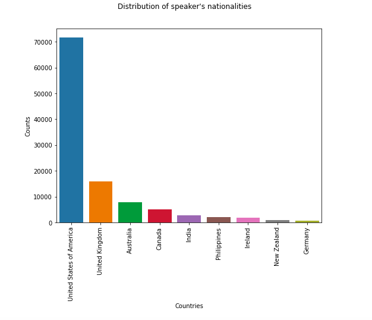
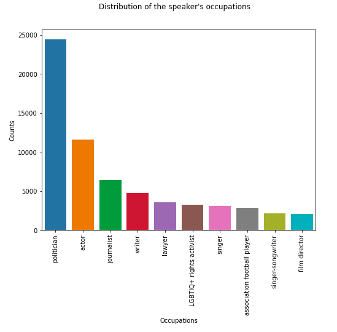

Gender norms are social principles that govern the behavior of all of us in society and restrict our gender identity into what is considered to be appropriate. These are neither static nor universal and change over time, and can result in inequalities.

More and more countries have recently legalized and recognized same-sex marriage, sometimes following long legal procedures. In Switzerland, this law was introduced in 2013, passed in 2020 by the parliament and adopted by referendum in September 2021. The feminism topic also indicates real changes in society. [LGBT](https://en.wikipedia.org/wiki/LGBT_community) issues are also extremely present in public life, with emerging pride movements and pure gender questioning. 
These topics have been more and more present in the media all over the world, and are still facing divergent opinions. In this review, we'll dive into this complex phenomenon, analyzing the different trends and opinions worldwide.

### Dataset

We acquired data from A Corpus of Quotations from a Decade of News, untitled *Quotebank*. It is a dataset of 178 million unique, speaker-attributed quotations that were extracted from 196 million English news articles crawled from over 377 thousand web domains between August 2008 and April 2020. However, our analysis was restricted from the start of 2015 to mid-2020. In addition, we used the free and open knowledge base *Wikidata* in order to get speaker's attributes such as nationalities and occupations.

### Focus & Research questions 

We will focus on observing changes in the speakers’ opinion on the topics of gender equality and same-sex relations, depending on their nationality, age, as well as possibly occupation, and quote date. It is also of interest to compare opinions within countries before and after national events, such as same-sex marriage legalization. This bring us to the following questions : 

- How legalization of same-sex marriage influenced the opinion of the authors of the quotes?
- Which countries' opinions significantly contrast with others ?
- Does the author's age significantly lead to different trends, i.e. does the youngest authors generally have broader gender norms ? 

Before answering to these questions, let's first have a visual look on our dataset.

### First glimpse at the data
<!--- _(add bar plot)!_ -->

Each year from 2015 to 2019 is composed between 20K to 50K quotes. The number of quotes in 2020 is below 10K as we only had access to a part of the year!  
Most of the quotes are related to the LGBT community (~40%), whereas the feminism topic is a bit less represented (~6-7%). However, we have access to enough data to make a complete analysis on gender norms.

<!--- _(add bar plot)!_ -->


While over 60% of the speakers are men, the *Other* category represents about 6% which in descending order of frequency appears like: [transgender female](https://en.wikipedia.org/wiki/Trans_woman), [gender fluid](https://www.health.harvard.edu/blog/gender-fluidity-what-it-means-and-why-support-matters-2020120321544), [transgender male](https://en.wikipedia.org/wiki/Trans_man), [non binary](https://en.wikipedia.org/wiki/Non-binary_gender), [bigender](https://gender.fandom.com/wiki/Bigender), [genderqueer](https://www.webmd.com/a-to-z-guides/what-does-genderqueer-mean), [shemale](https://en.wikipedia.org/wiki/Shemale), [two-spirit](https://en.wikipedia.org/wiki/Two-spirit), [third gender](https://en.wikipedia.org/wiki/Third_gender).

The disparity between speakers can also be seen in their nationality distribution :

   

As well as their occupation distribution : 

American politicians are the ones talking the most on the gender norms, followed by actors and journalists. Without surprise, LGBTIQ+ rights activists are also quite present. It will be now interesting to answer our first research question : 

### What is sentiment analysis ?

...

### What is stance ?

...

-----------------
## How legalization of same-sex marriage influenced the opinion of the authors of the quotes?

The first purpose of our analysis is to focus on a political aspect of same-sex relations, and in particular such a marriage legalization. We indeed believe that such this legal process became popular in countries following people agreement to integrate it in their public life. In this way, an increasing popularity of the same-sex mariage topic could correlate with legal outcomes.

To compare the average sentiment on same-sex marriage before and after its legalization, we picked countries where the number of quotes could allow basic statistical assessments, by picking only those with at least 100 quotes related to this topic.

The following table summarizes the data we may use for our analysis:

| Country | Number of quotes | Legalization date |
|:-------:|:--------:|:---------:|
| United States of America | 4'173 | [07/2015](https://en.wikipedia.org/wiki/Same-sex_marriage_in_the_United_States) |
| Australia | 1'869 | [12/2017](https://en.wikipedia.org/wiki/Same-sex_marriage_in_Australia) |
| United Kingdom | 797 | [03/2014](https://en.wikipedia.org/wiki/Same-sex_marriage_in_the_United_Kingdom) |
| Ireland | 277 | [11/2015](https://en.wikipedia.org/wiki/Same-sex_marriage_in_the_Republic_of_Ireland) |
| Canada | 259 | [07/2005](https://en.wikipedia.org/wiki/Same-sex_marriage_in_Canada) |

Given United Kingdom and Canada did undergo legal procedures before the first data we could access from *Quotebank* dataset, we could not assess anything regarding the trends in sentiment before and after these leglizations.

We could compute the following statistics in order to answer our question: 

| Country | Average sentiment   (-1 to +1) | Sentiment progress following legalization | Significance |
|:-------:|:---------:|:---------:|:---------:|
| United States of America | 0.19 | -0.04 | 96% |
| United Kingdom | 0.12 | - | - |
| Australia | 0.24 | -0.05 | 92% |
| Ireland | 0.26 | +0.23 | 99% |
| Canada | 0.13 | - | - |

-----------------
## Which countries' opinions significantly contrast with others ?
