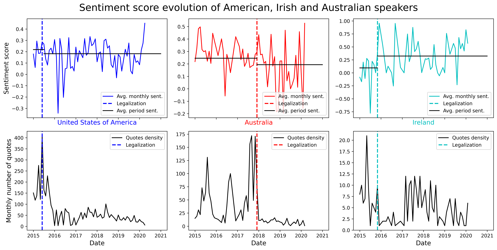
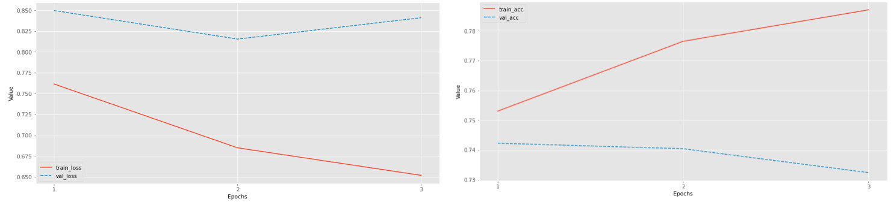
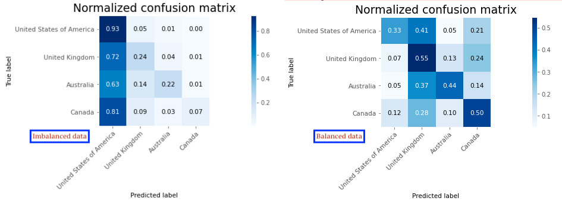
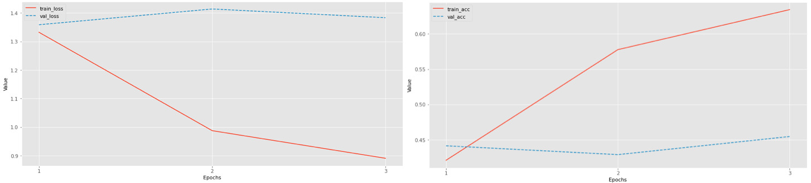

## Understanding our motivation...

Gender norms are social principles that govern the behavior of all of us in society and restrict our gender identity into what is considered to be appropriate. These are neither static nor universal and change over time, and can result in inequalities.

More and more countries have recently legalized and recognized same-sex marriage, sometimes following long legal procedures. In Switzerland, this law was introduced in 2013, passed in 2020 by the parliament and adopted by referendum in September 2021. The feminism topic also indicates real changes in society. [LGBT](https://en.wikipedia.org/wiki/LGBT_community) issues are also extremely present in public life, with emerging pride movements and pure gender questioning. 
These topics have been more and more present in the media all over the world, and are still facing divergent opinions. In this review, we'll dive into this complex phenomenon, analyzing the different trends and opinions worldwide.

### Available data

We acquired data from [*Quotebank : A Corpus of Quotations from a Decade of News*](https://dlab.epfl.ch/people/west/pub/Vaucher-Spitz-Catasta-West_WSDM-21.pdf). It is a dataset of 178 million unique, speaker-attributed quotations that were extracted from 196 million English news articles crawled from over 377 thousand web domains between August 2008 and April 2020. However, our analysis was restricted from the start of 2015 to mid-2020. In addition, we used the free and open knowledge base *Wikidata* in order to get speaker's attributes such as nationalities and occupations.

### Focus & Research questions 

We will focus on observing changes in the speakers’ opinion on the topics of gender equality and same-sex relations, depending on their nationality, age, as well as possibly occupation, and quote date. It is also of interest to compare opinions within countries before and after national events, such as same-sex marriage legalization. This bring us to the following questions: 

- How legalization of same-sex marriage influenced the opinion of the authors of the quotes?
- Which countries' opinions significantly contrast with others ? 
- Is it possible to predict speaker's attributes based on quotes ?

Before answering to these questions, let's first have a visual look on our dataset.

### First glimpse at the data

<!--- _(add bar plot)!_ -->

Each year from 2015 to 2019 is composed between 20K to 50K quotes. The number of quotes in 2020 is below 10K as we only had access to a part of the year!  
Most of the quotes are related to the LGBT community (~40%), whereas the feminism topic is a bit less represented (~6-7%). However, we have access to enough data to make a complete analysis on gender norms.

<!--- _(add bar plot)!_ -->


While over 60% of the speakers are men, the *Other* category represents about 6% which in descending order of frequency appears like: [transgender female](https://en.wikipedia.org/wiki/Trans_woman), [gender fluid](https://www.health.harvard.edu/blog/gender-fluidity-what-it-means-and-why-support-matters-2020120321544), [transgender male](https://en.wikipedia.org/wiki/Trans_man), [non binary](https://en.wikipedia.org/wiki/Non-binary_gender), [bigender](https://gender.fandom.com/wiki/Bigender), [genderqueer](https://www.webmd.com/a-to-z-guides/what-does-genderqueer-mean), [shemale](https://en.wikipedia.org/wiki/Shemale), [two-spirit](https://en.wikipedia.org/wiki/Two-spirit), [third gender](https://en.wikipedia.org/wiki/Third_gender).

The disparity between speakers can also be seen in their nationality distribution:

   

As well as their occupation distribution: 

American politicians are the ones talking the most on the gender norms, followed by actors and journalists. Without surprise, LGBTIQ+ rights activists are also quite present.

Before taking a look at what our data can explain, let's get back to some programming concepts we will need in this analysis.

-----------------
## What is sentiment analysis ?

[Sentiment analysis](https://en.wikipedia.org/wiki/Sentiment_analysis), also referred to as opinion mining, is a classification technique which aims to analyze sentences to extract the expressed sentiment from them, and capture how positive or negative this statement is. In our analysis, the [NLTK - Natural Language Toolkit](https://www.nltk.org) library was used and allowed to compute sentiment scores ranging from -1 to +1, corresponding to negative and postive extrema, respectively. In fact, the *compound* score was the one we selected and is the sum of positive, negative & neutral scores which is then normalized between -1 (most extreme negative) and +1 (most extreme positive). The closer this *compound* to +1, the higher the positivity of the text.

## What is stance ?

Sentiment analysis is thus a useful way to quantify a feeling from a text, but it is based on emotions rather than opinions.

Thus, [stance analysis](https://en.wikipedia.org/wiki/Stance_(linguistics)) goes beyond this border, by determining if two sentences converge to similar or different opinions. This technique provides a classification of a list quotes when comparing with a *model* quote, by categorizing them into 4 sets : *agree*, *disagree*, *uncertain*, and *unrelated*.

-----------------
## How legalization of same-sex marriage influenced the opinion of the authors of the quotes?

The first purpose of our analysis is to focus on a political aspect of same-sex relations, and in particular such a marriage legalization. We indeed believe that such this legal process became popular in countries following people agreement to integrate it in their public life. In this way, an increasing popularity of the same-sex mariage topic could correlate with legal outcomes.

To compare the average sentiment on same-sex marriage before and after its legalization, we picked countries where the number of quotes could allow basic statistical assessments, by picking only those with at least 100 quotes related to this topic.

The following table summarizes the data we may use for our analysis:

| Country | Number of quotes | Legalization date |
|:-------:|:--------:|:---------:|
| United States of America (USA) | 4'173 | [07/2015](https://en.wikipedia.org/wiki/Same-sex_marriage_in_the_United_States) |
| Australia (AUS) | 1'869 | [12/2017](https://en.wikipedia.org/wiki/Same-sex_marriage_in_Australia) |
| United Kingdom (UK) | 797 | [03/2014](https://en.wikipedia.org/wiki/Same-sex_marriage_in_the_United_Kingdom) |
| Ireland (IRE) | 277 | [11/2015](https://en.wikipedia.org/wiki/Same-sex_marriage_in_the_Republic_of_Ireland) |
| Canada (CAN) | 259 | [07/2005](https://en.wikipedia.org/wiki/Same-sex_marriage_in_Canada) |

We plotted their respective sentiment score evolution across times:



These plots alone do not allow to infer anything apart from relative country's means if comparing a specific time point. Thus, for each of these, we separated the quites in two splits: before and after legalization. Given United Kingdom and Canada did undergo legal procedures before the first data we could access from *Quotebank* dataset, we could not assess anything regarding the trends in sentiment before and after these legalizations.

We could compute the following statistics in order to answer our question: 

| Country | Average sentiment   (-1 to +1) | Sentiment progress following legalization | Significance |
|:-------:|:---------:|:---------:|:---------:|
| United States of America | +0.19 | -0.04 | 96% |
| United Kingdom | +0.22 | - | - |
| Australia | +0.24 | -0.05 | 92% |
| Ireland | +0.26 | +0.23 | 99% |
| Canada | +0.26 | - | - | 

Irish speakers are the ones showing the most positive sentiments about same-sex marriage. There are also the ones that progress (positively) the most in their sentiments after legalization of same-sex marriages (with a significance of 99%). They are followed by Australians, who on the contrary show a slight reluctance after legalization (with a significance of 92%). Finally, Americans are also less optimistic on this new event (slight decrease in sentiment). Overall, it is interesting to note that on average, between 2015 and 2020, none of the nationalities are expressing negative sentiments. However, it does not mean that all speakers have positive opinions on this topic, it might actually differ between years and other speaker's specific features.

The upper series of plots allows to observe changes in sentiment scores when comparing the periods before and after same-sex marriage legalization. Contrasts are not always crystal clear. One should pay attention to the fact that these averages curves reflect averages by quote rather than averages by month, which explains why these average lines do not always seem to be the average of the corresponding sentiment curve. The lower series of plots shows the number of quotes per month, which can be interpreted as a popularity metric. This time, contrasts can be much more easily visualized, and a clear trend appears : the popularity of the same-sex marriage topic decreases straight after its legalization. On the other hand, conclusions regarding its effect on quotes' sentiment can hardly be assessed as the effect of legalization at large scale does not seem to lead to strong changes.

-----------------
## Which countries' opinions significantly contrast with others ?

<embed type="text/html" src="assets/img/sentiment.html" width="600" height="400"></embed>



-----------------
## Could we predict an author's nationality based on a quote ?

As gender equality is an emerging topic, there are more and more people discussing it. So not all of them are famous. In our dataset, 30% of speakers are not referenced in Wikidata. In order not to lose data we decided to add synthetic features by training the classification model. We expected to obtain the feature (nationality, age etc) using neural networks approach giving it a quote as input. 

Firstly, we started by simple LSTM + Linear model to predict nationality and age of the quote’s speaker. To implement this we used PyTorch framework, wrote classes of dataset, training and model. As embedding we used Twitter-roBERTa-base pretrained tokenizer. But the model was too simple and we got ~30% by F1 metric. 
So we took a more complex model - GPT2 in order to predict the nationality of the speaker by its quote. At the first sight, we got better results ~70% on the validation set. 

But after checking the confusion matrix we found out that the model returns the most frequent value all the time, so we balanced classes. 

Finally we got much worse results which didn’t seem to improve as we saw by the validation loss plot. 

Based on the quote it seems impossible to predict a nationality, because of the globalisation process and information spread on the Internet. Not many countries are completely isolated and there are always different sources of information, so people’s mindset can’t be defined by their location. 
